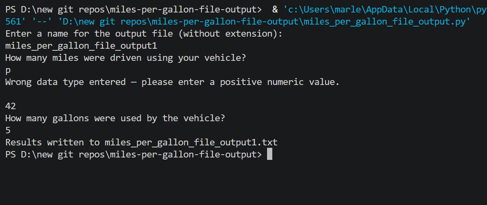
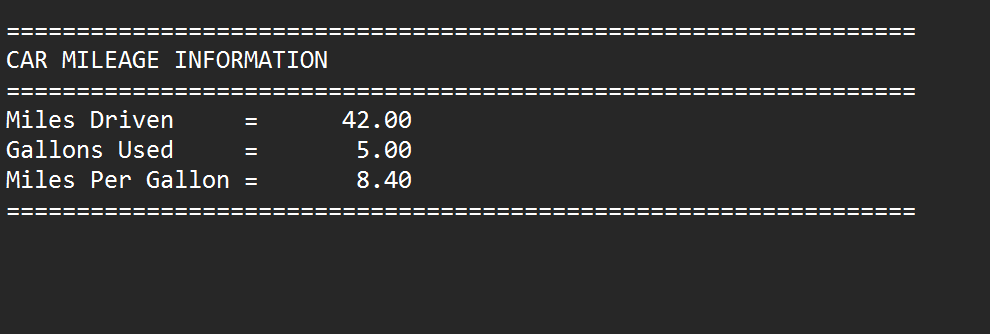

# ⛽ Miles Per Gallon Calculator — Functions with File Output

A Python MPG calculator that uses modular functions and writes results to a user-named external text file, demonstrating file I/O combined with function-based design.

---

## Features

- Prompts user for an output file name
- Input validation using a reusable `checkFloatDataType()` function
- Calculation handled by `calcMPG()` function
- Results written to `.txt` file via `writeResults()` function
- Demonstrates passing a file handle as a function parameter

---

## Functions

| Function | Purpose |
|---|---|
| `checkFloatDataType(data_type)` | Validates positive float input; re-prompts on bad input |
| `calcMPG(miles, gals)` | Calculates and returns miles per gallon |
| `writeResults(mls, gal, mpg, out_file)` | Writes formatted MPG report to the output file |

---

## How It Works

1. User enters a name for the output file (e.g. `results` → creates `results.txt`)
2. User enters miles driven and gallons used (validated by `checkFloatDataType()`)
3. `calcMPG()` calculates the MPG value
4. `writeResults()` writes the formatted report to the `.txt` file
5. File is closed and user is notified

---

## Example Output File Contents

```
=================================================================
CAR MILEAGE INFORMATION
=================================================================
Miles Driven     =      320.00
Gallons Used     =       10.00
Miles Per Gallon =       32.00
=================================================================
```

---

## Screenshot



## Screenshot of Output Text File


---

## Bugs That Were Fixed

The original file had four bugs that prevented it from running:
1. `writeResults()` used undefined variable `gals` — should be parameter `gal`
2. `writeResults()` used undefined variable `miles` — should be parameter `mls`
3. `outFile.write()` called with no arguments — fixed to `out_file.write("\n")`
4. `writeResults()` called with no arguments — fixed to pass all 4 required values

---

## Technologies Used

- Python 3
- File I/O — `open()`, `write()`, `close()`
- User-defined functions with parameters and return values
- `try/except` input validation

---

## Learning Outcomes

- Writing output to an external text file
- Passing a file handle as a function parameter
- Debugging function parameter mismatches
- Combining file I/O with modular function design

---

## How to Run

1. Make sure Python 3 is installed: https://www.python.org/downloads/
2. Clone or download this repo
3. Open a terminal in the repo folder
4. Run: `python miles_per_gallon_file_output.py`
5. Enter a file name when prompted — a `.txt` file will be created in the same folder

---

## Folder Structure

```
miles-per-gallon-file-output/
├── miles_per_gallon_file_output.py
├── miles_per_gallon_file_output1
├── output.png
├── output2.png
├── README.md
├── LICENSE
└── .gitignore
```

---

## License

This project is licensed under the MIT License — see the [LICENSE](LICENSE) file for details.

---

*Written by Marlena Fabrick — Computer Programming, Fall 2020*

---
